# **Web Application Depolyment Project**
This repository demonstrates two deployment approaches for my personal portfolio project:
1. Serverless Depolyment on GitHub Pages
2. GitOps-driven Depolyment
3. Serverless Static Website on AWS (S3 + CloudFront + GitHub Actions)

## **1. Serverless Depolyment - GitHub Pages**

This deployment serves the portfolio as a static website hosted on GitHub Pages, using CI/CD pipelines for automation.

Tech Stack:
* React, TypeScript, Framer Motion, Vite
* GitHub Actions (CI/CD)
* SonarQube (code quality)
* Nexus Repository (artifact storage)
* GitHub Pages (hosting with custom domain)

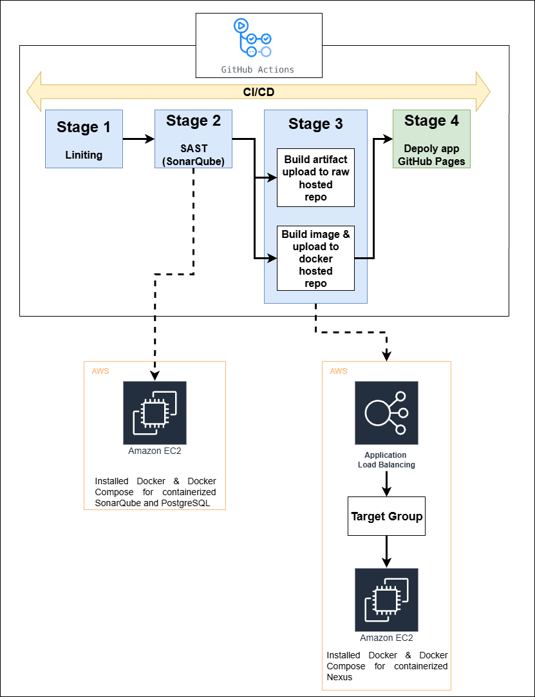

---

### **DevOps & Cloud Implementation**

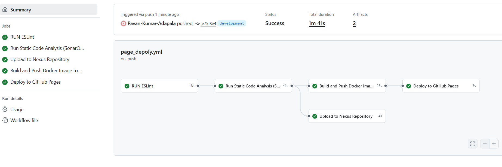

Push Code: Developer pushes to main or development branch.

CI/CD Pipeline:

* Linting and static code analysis via **SonarQube**

* **Build optimized artifacts** with Vite

* **Artifact Management**: Upload artifacts to **Nexus** raw repository

* **Deployment**: Automatically deploy to **GitHub Pages** with a custom domain

---

#### **Static Code Analysis – SonarQube**

* **Self-hosted SonarQube** server provisioned on Ubuntu.
* Installed **Docker & Docker Compose** for containerized SonarQube and PostgreSQL.
* Configured **GitHub Actions** to upload reports to the SonarQube server for:

  * Code quality checks
  * Maintainability ratings
  * Security vulnerability scanning

  Note:
  - Inside server installed docker and docker compose
    
    ```bash
    #!/bin/bash
    echo "Updating package lists..."
    sudo apt-get update

    echo "Installing prerequisites..."
    sudo apt-get install ca-certificates curl

    echo "Adding Docker GPG key..."
    sudo install -m 0755 -d /etc/apt/keyrings
    sudo curl -fsSL https://download.docker.com/linux/ubuntu/gpg -o /etc/apt/keyrings/docker.asc
    sudo chmod a+r /etc/apt/keyrings/docker.asc

    echo "Adding Docker repository..."
    echo \
      "deb [arch=$(dpkg --print-architecture) signed-by=/etc/apt/keyrings/docker.asc] https://download.docker.com/linux/ubuntu \
      $(. /etc/os-release && echo "${UBUNTU_CODENAME:-$VERSION_CODENAME}") stable" | \
      sudo tee /etc/apt/sources.list.d/docker.list > /dev/null

    echo "Updating package lists again..."
    sudo apt-get update

    echo "Installing Docker Engine & tools..."
    sudo apt-get install -y docker-ce docker-ce-cli containerd.io docker-buildx-plugin docker-compose-plugin

    echo "Adding user '$USER' to docker group..."
    sudo usermod -aG docker "$USER"
    echo "Docker installed. Please log out & back in or run 'newgrp docker' to apply group change."
    ```
    
  - docker compose file to access SonarQube server

    ```yaml
    services:
      sonarqube:
        depends_on:
          sonar_db:
            condition: service_healthy
        image: mc1arke/sonarqube-with-community-branch-plugin:25.6.0.109173-community
        environment:
          - SONAR_JDBC_URL=jdbc:postgresql://sonar_db:5432/sonar
          - SONAR_JDBC_USERNAME=sonar
          - SONAR_JDBC_PASSWORD=sonar
        container_name: sonarqube
        ports:
          - "9000:9000"
        networks:
          - sonarnet
        volumes:
          - sonarqube_conf:/opt/sonarqube/conf
          - sonarqube_data:/opt/sonarqube/data
          - sonarqube_extensions:/opt/sonarqube/extensions
          - sonarqube_logs:/opt/sonarqube/logs
          - sonarqube_temp:/opt/sonarqube/temp

      sonar_db:
        image: postgres:16
        healthcheck:
          test: [ "CMD-SHELL", "pg_isready -U sonar" ]
          interval: 10s
          timeout: 5s
          retries: 5
        environment:
          - POSTGRES_USER=sonar
          - POSTGRES_PASSWORD=sonar
        hostname: sonar_db
        container_name: postgres
        networks:
          - sonarnet
        volumes:
          - postgresql:/var/lib/postgresql
          - postgresql_data:/var/lib/postgresql/data

    volumes:
      sonarqube_conf:
      sonarqube_data:
      sonarqube_extensions:
      sonarqube_logs:
      sonarqube_temp:
      postgresql:
      postgresql_data:
      
    networks:
      sonarnet:
    ```
  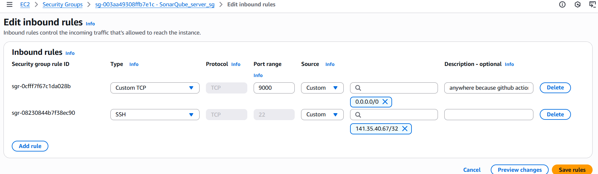
  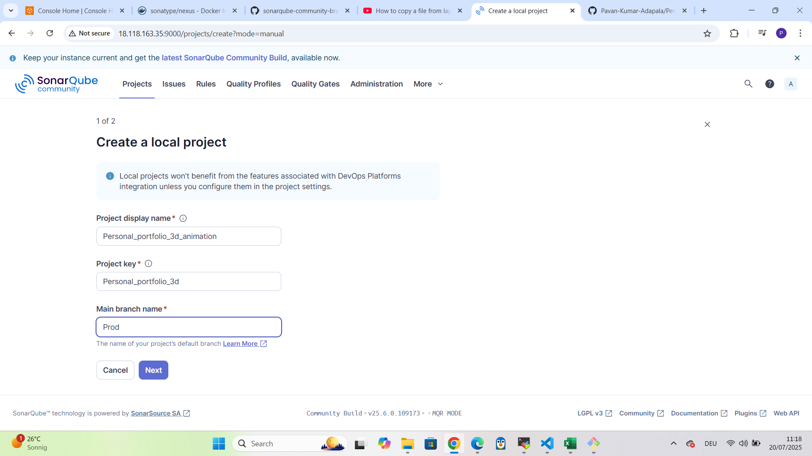
  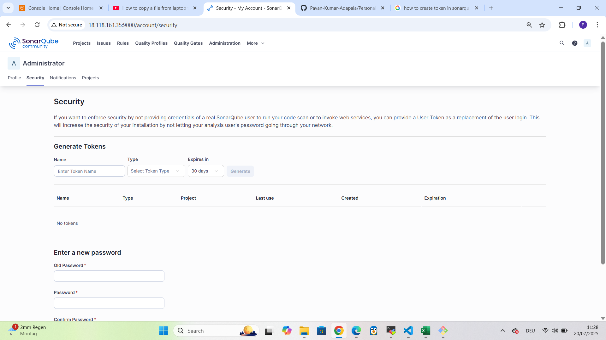
  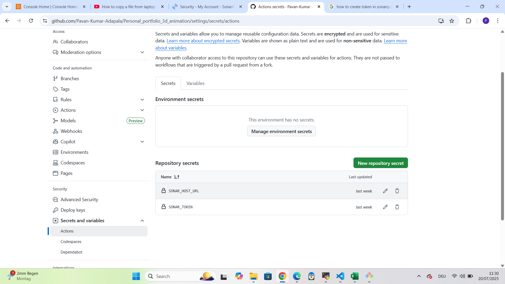

---

#### **Artifact Management – Nexus Repository**

* Deployed **Sonatype Nexus** via Docker Compose.
* Configured:

  * **Raw repository** for application build artifacts
  * **Docker hosted repository** for container images
* Integrated with CI/CD to:

  * Upload build artifacts automatically
  * Push container images to Nexus Docker registry
  * Configured **AWS Application Load Balancer (ALB)** as a reverse proxy with security groups.

  Note:

  * docker compose file to access Nexus server

  ```yaml
  services:
  nexus:
    image: sonatype/nexus3
    restart: always
    volumes:
      - "nexus-data:/sonatype-work"
    ports:
      - "8081:8081" # For Nexus UI
      - "5000:5000" # For HTTP
  volumes:
    nexus-data: {}
  ```

  ##### Nexus server and ALB for Reverse proxy
  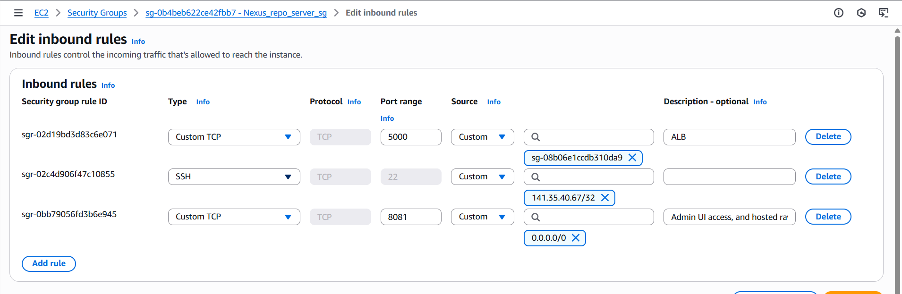
  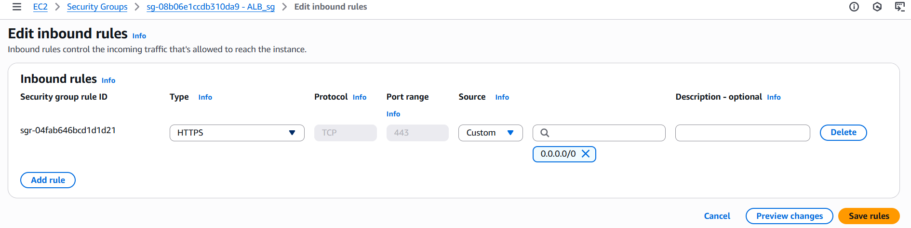
  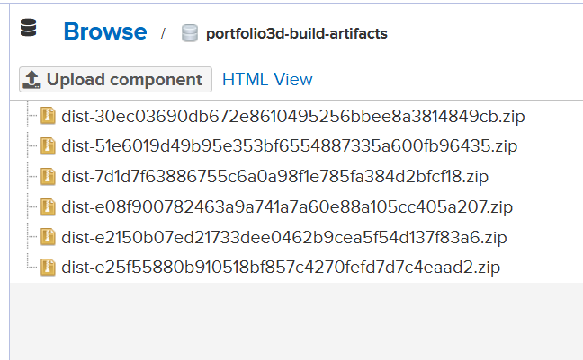
  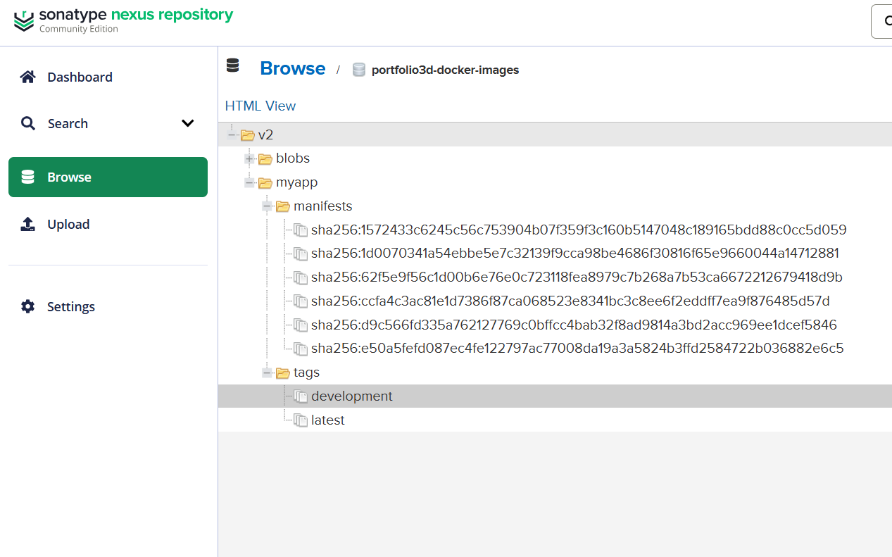

---

#### **Deployment – GitHub Pages**

* Automated deployment from `gh-pages` branch.
* Configured **custom domain** and DNS settings for professional hosting.
  ##### Custom domain in github pages
  - https://docs.github.com/en/pages/configuring-a-custom-domain-for-your-github-pages-site/verifying-your-custom-domain-for-github-pages

  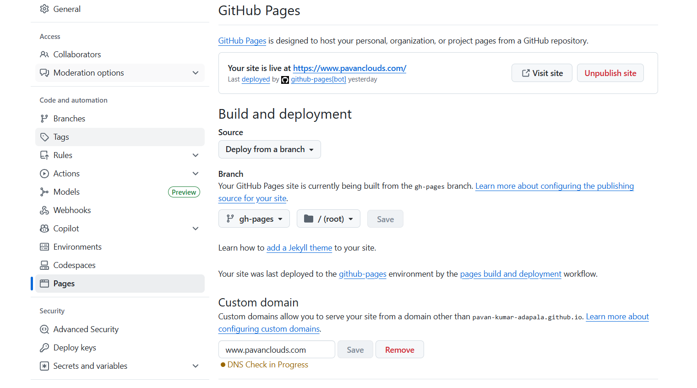

---

### **Infrastructure & Configuration Management**

* Provisioned servers manually using **shell scripting** and **Docker Compose**.
* Configured **security groups** for controlled access to SonarQube, Nexus, and ALB.

---

### **Branching Strategy & Collaboration**

* Implemented **Git workflow best practices**:

  

  * `main` – production-ready code
  * `development` – integration branch
  * Short-lived **feature branches**
  * **Hotfix branches** for urgent fixes
  * **Release branches** for staging before production
  * Enforced **branch protection rules**:

  * Mandatory **CI checks** before merge
  * **Code review approval** before integration
  * Resolved Code Conflicts

---

### **Key DevOps Tools & Technologies**

**CI/CD:** GitHub Actions
**Code Quality:** SonarQube
**Artifact Management:** Nexus Repository
**Containerization:** Docker, Docker Compose
**Hosting & Networking:** AWS ALB, GitHub Pages
**Version Control:** Git, GitHub Branch Protection Rules

---

## 2. GitOps-driven Depolyment with ArgoCD


### **Kubernetes Cluster Setup**
* Wrote **multi-stage Dockerfile** for optimized application containerization.
* Provisioned manually using **kubeadm** on AWS EC2
* Installed:

  * **kubectl**, **kubeadm**, **kubelet**
  * **CNI Plugin (Calico)**
  * **ArgoCD** for GitOps-based deployments

  ```bash
  #!/bin/bash
  # This script sets up Kubernetes using kubeadm on a Linux system.
  echo "Update the system packages..."
  sudo apt-get update -y && sudo apt-get upgrade -y
  echo "Installing required packages..."
  sudo apt-get install -y apt-transport-https ca-certificates curl software-properties-common gpg
  echo "Disabling swap..."
  sudo swapoff -a
  echo "making swap off persistent... disabled in config file /etc/fstab"
  sudo sed -i '/ swap / s/^\(.*\)$/#\1/g' /etc/fstab
  # sudo sed -i '/ swap / s/^/#/' /etc/fstab
  echo "Install and configure container runtime..."
  sudo apt-get install -y containerd
  sudo mkdir -p /etc/containerd
  sudo containerd config default | sudo tee /etc/containerd/config.toml > /dev/null
  echo "Enable Systemd cgroup driver..."
  sudo sed -i 's/SystemdCgroup = false/SystemdCgroup = true/' /etc/containerd/config.toml
  echo "Restarting containerd service..."
  sudo systemctl restart containerd
  sudo systemctl enable containerd
  echo "Installing kubeadm, kubelet and kubectl..."
  echo "Adding Kubernetes APT repository..."
  sudo apt-get update
  curl -fsSL https://pkgs.k8s.io/core:/stable:/v1.33/deb/Release.key | sudo gpg --dearmor -o /etc/apt/keyrings/kubernetes-apt-keyring.gpg
  echo "deb [signed-by=/etc/apt/keyrings/kubernetes-apt-keyring.gpg] https://pkgs.k8s.io/core:/stable:/v1.33/deb/ /" | sudo tee /etc/apt/sources.list.d/kubernetes.list
  sudo apt-get update
  sudo apt-get install -y kubelet kubeadm kubectl
  echo "Marking kubelet, kubeadm and kubectl to hold..."
  sudo apt-mark hold kubelet kubeadm kubectl
  echo "You can now initialize your Kubernetes cluster using 'kubeadm init'."
  echo "Load Required Kernel Modules..."
  cat <<EOF | sudo tee /etc/modules-load.d/k8s.conf
  overlay
  br_netfilter
  EOF
  sudo modprobe overlay
  sudo modprobe br_netfilter
  echo "Configure Network Settings for Kubernetes..."
  cat <<EOF | sudo tee /etc/sysctl.d/k8s.conf
  net.bridge.bridge-nf-call-ip6tables = 1
  net.bridge.bridge-nf-call-iptables = 1
  net.ipv4.ip_forward = 1
  EOF
  sudo sysctl --system
  echo "Kubernetes setup completed successfully!"
  # echo "sudo kubeadm init --pod-network-cidr=192.168.0.0/16(you can replace) --apiserver-advertise-address=$PRIVATE_IP"
  # echo "To join worker nodes to the cluster, run the following command on each worker node:"
  # echo "sudo kubeadm join <control-plane-private-ip>:6443 --token <token> --discovery-token-ca-cert-hash sha256:<hash>"
  ```
  #### Initialize Kubernetes Control Plane
  sudo kubeadm init --pod-network-cidr=192.168.0.0/16(you can replace) --apiserver-advertise-address=$PRIVATE_IP

  Note: Please make sure cidr not conflict with your VPC cidr range

  #### To start using your cluster, you need to run the following as a regular user:
  
```bash
  mkdir -p $HOME/.kube
  sudo cp -i /etc/kubernetes/admin.conf $HOME/.kube/config
  sudo chown $(id -u):$(id -g) $HOME/.kube/config
  ```

  #### Install Calico CNI using manifest:

    kubectl apply -f https://raw.githubusercontent.com/projectcalico/calico/v3.28.1/manifests/calico.yaml

  #### Then you can join any number of worker nodes by running the following on each as root

  ```bash
    sudo kubeadm join <control-plane-private-ip>:6443 --token <token> --discovery-token-ca-cert-hash sha256:<hash>
  ```
  

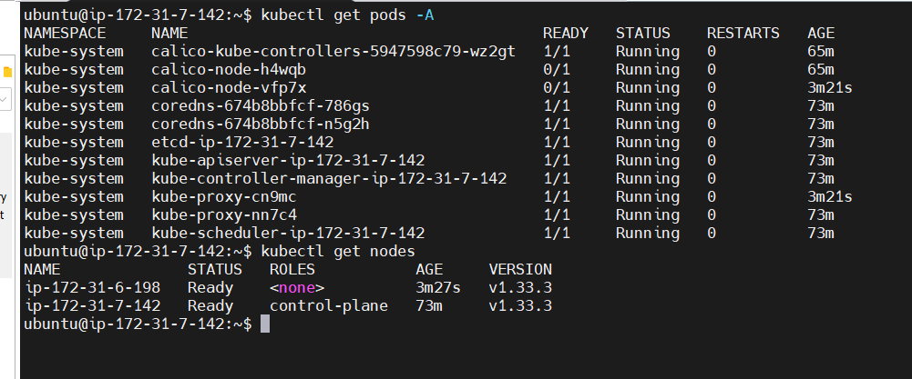


---

### **ArgoCD GitOps Workflow**

1. Push application manifests to GitHub repo
2. ArgoCD continuously syncs to Kubernetes cluster
3. Any new commit → automatic deployment/update

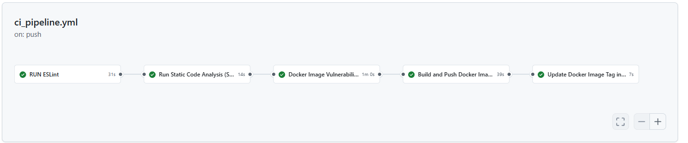

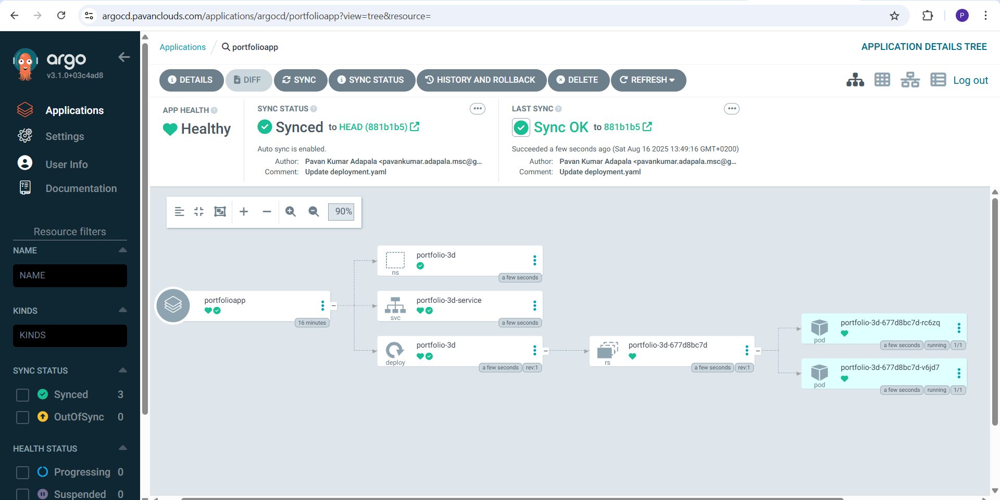

*Architecture Diagram:*


---

### **Networking & Access**

* Configured **Kubernetes Services** (NodePort)

  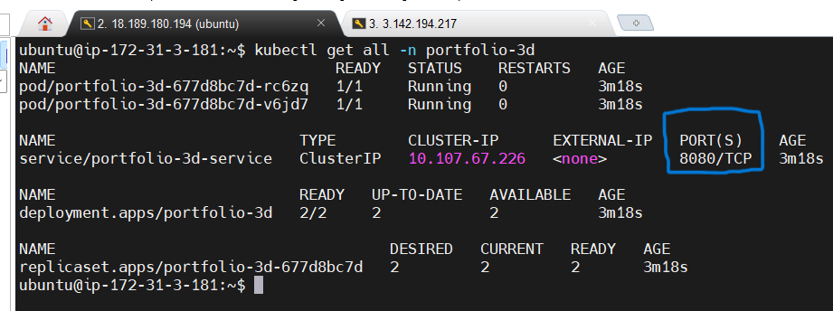
  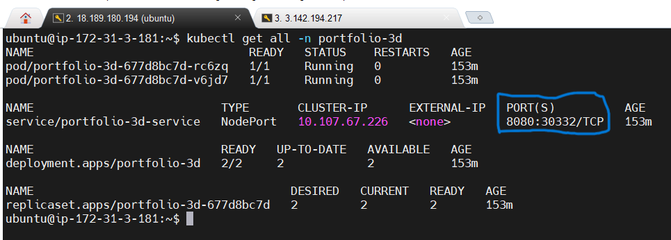

* Integrated with **AWS ALB** manually for HTTPS + host-based routing

  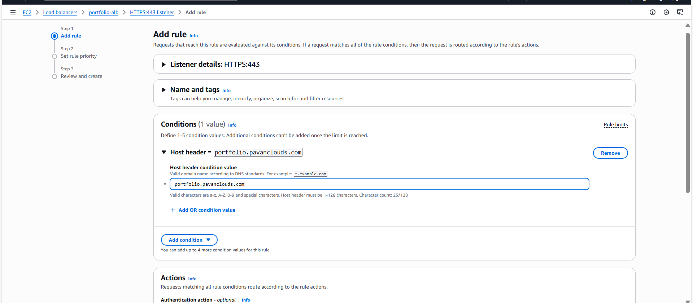

  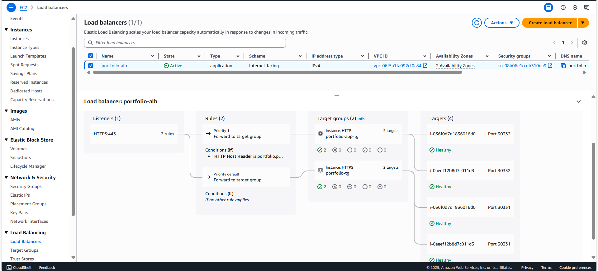

* Secured with Security Groups & SSL termination at ALB

  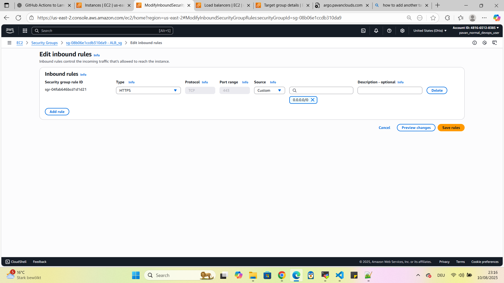

  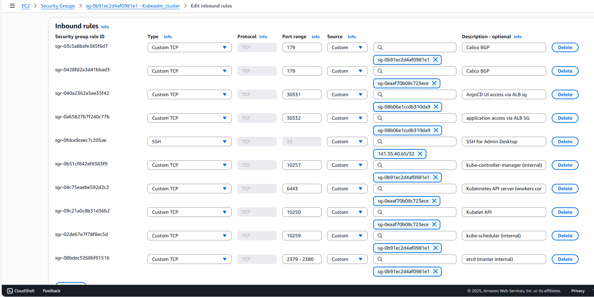

  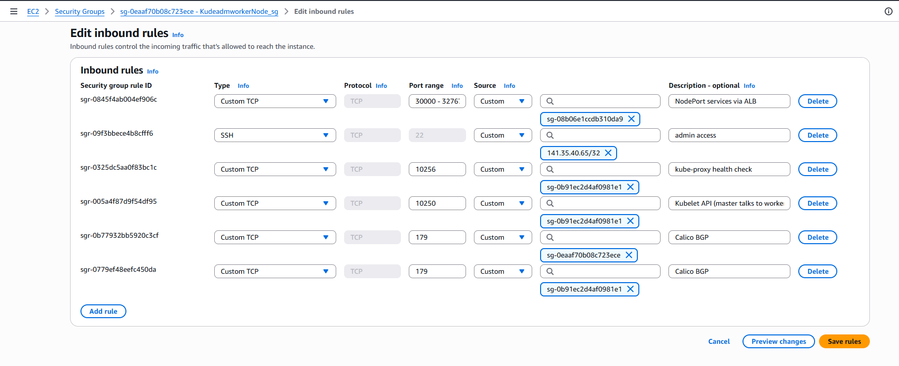


---

### **Deployment Manifest**

```yaml
apiVersion: v1
kind: Namespace
metadata:
  name: portfolio-3d
---
apiVersion: apps/v1
kind: Deployment
metadata:
  name: portfolio-3d
  namespace: portfolio-3d
spec:
  replicas: 2
  selector:
    matchLabels:
      app: portfolio-3d
  template:
    metadata:
      labels:
        app: portfolio-3d
    spec:
      containers:
        - name: portfolio-3d-container
          image: adapaladocker/personal_portfolio_3d:Prod-1066e01be3ac334d1162843ced58f1e39e1755fb
          ports:
            - containerPort: 80
          resources:
            requests:
              memory: "256Mi"
              cpu: "250m"
            limits:
              memory: "1Gi"
              cpu: "1"
      restartPolicy: Always
---
apiVersion: v1
kind: Service
metadata:
  name: portfolio-3d-service
  namespace: portfolio-3d
spec:
  selector:
    app: portfolio-3d
  ports:
    - protocol: TCP
      port: 8080 
      targetPort: 80
      nodePort: 30332
  type: NodePort
```

---

# **Key Tools & Technologies**

* **CI/CD:** GitHub Actions
* **Security Tools:** SonarQube, Trivy
* **Artifact Management:** Nexus Repository
* **Hosting:** AWS EC2 + Kubernetes
* **Containerization:** Kubernetes, Docker
* **Networking:** NACLs, Securitg groups, ALB, DNS, HTTP, HTTPS
* **GitOps:** ArgoCD

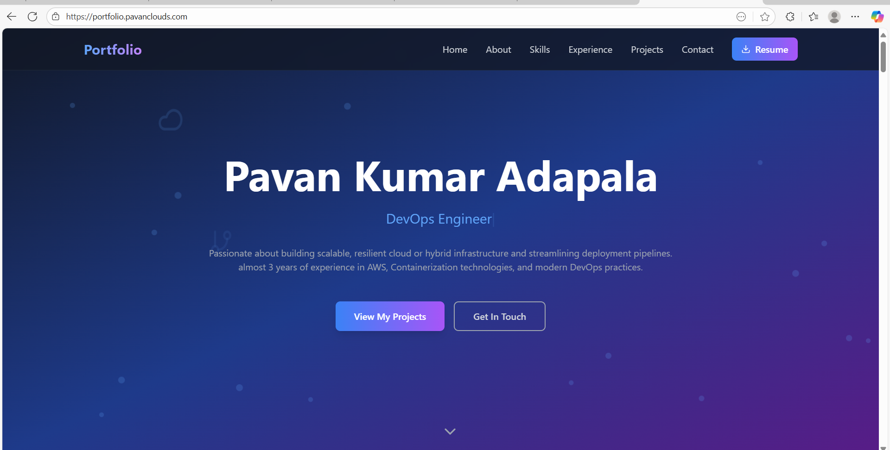
---

# **Future Enhancements**

* Automate infra provisioning with **Terraform**
* Replace manual ALB setup with **AWS Load Balancer Controller**
* Implement **Helm charts** for reusable manifests
* Enable **Argo Rollouts** for progressive delivery

---

## **3. Serverless Static Website on AWS (S3 + CloudFront + GitHub Actions)**

This project deploys a static app using **fully managed, serverless services**:

* **Amazon S3** for object storage and hosting
* **Amazon CloudFront** (with **OAC**) for secure, global CDN delivery
* **AWS WAF** for edge security
* **GitHub Actions** for CI/CD

Because this is **serverless**, AWS handles availability, scaling, TLS, patching, and fleet management—**reducing operational overhead** to near-zero.

> **Architecture**
>
> 

---

### Approach 1 — S3 Static Website Hosting (Public, simple)

1. Create S3 bucket
  * **Enable Static Website Hosting**
  * **Disable Block Public Access**
2. Apply bucket policy (example with IP allowlist):

```json
{
  "Version": "2012-10-17",
  "Statement": [
    {
      "Sid": "PublicReadForStaticWebsite",
      "Effect": "Allow",
      "Principal": "*",
      "Action": "s3:GetObject",
      "Resource": "arn:aws:s3:::pavan-portfolio-app-testing/*",
      "Condition": {
        "IpAddress": { "aws:SourceIp": "103.45.22.0/24" }
      }
    }
  ]
}
```

3. CI GitHub Action pipeline (.github/workflows/s3_bucket_triger.yml) uploads build artifacts to S3

4. Test: `http://pavan-portfolio-app-testing.s3-website.us-east-2.amazonaws.com`

> Fast to set up.
> ⚠️ Bucket must be public; HTTP only; fewer security controls at the edge.

---

### Approach 2 — **Recommended (Production)**: S3 (private) + **CloudFront + OAC** + WAF

**S3**

* **Block Public Access: ON**
* **Static website hosting: OFF** (use S3 as an origin only)

**OAC**

* CloudFront Console → *Security → Origin access control* → **Create OAC**

**CloudFront**

* Create Distribution → *Single website or app*
* Origin = your S3 bucket
* **Enable WAF**
* **Default Root Object** = `index.html`

**Bucket policy** (auto-created when attaching OAC):

```json
{
  "Version": "2008-10-17",
  "Id": "PolicyForCloudFrontPrivateContent",
  "Statement": [
    {
      "Sid": "AllowCloudFrontServicePrincipal",
      "Effect": "Allow",
      "Principal": { "Service": "cloudfront.amazonaws.com" },
      "Action": "s3:GetObject",
      "Resource": "arn:aws:s3:::pavan-portfolio-app-testing/*",
      "Condition": {
        "ArnLike": {
          "AWS:SourceArn": "arn:aws:cloudfront::481665128385:distribution/E31HPGJ4YNG9WU"
        }
      }
    }
  ]
}
```

Test: `https://d1zh3trwd3hjm7.cloudfront.net/`

> ✅ **Serverless & secure by default** (private S3, TLS via CloudFront, edge caching, WAF).
> ✅ Lowest operational overhead for production.

---

### Why this is “Serverless” (and lower operations)

* **No servers to manage** — S3/CloudFront/WAF are fully managed.
* **Automatic scaling** — Global edge network + S3 durability/throughput.
* **Built-in reliability** — Multi-AZ backing and global Points of Presence (POPs).
* **Security at the edge** — OAC keeps S3 private; WAF blocks bad traffic.
* **Pay for what you use** — Storage + requests + data transfer.

---

**1. Create an IAM Identity Provider in your AWS account for GitHub OIDC**
To use GitHub's OIDC provider, you must first set up federation in your AWS account. This involves creating an IAM Identity Provider that trusts GitHub's OIDC endpoint.
- You can create an IAM Identity Provider in the AWS Management Console 
- You can also create the IAM Identity Provider using the AWS CLI

aws iam create-open-id-connect-provider --url https://token.actions.githubusercontent.com --client-id-list sts.amazonaws.com 
Output:
  "OpenIDConnectProviderArn": "arn:aws:iam::481665128385:oidc-provider/token.actions.githubusercontent.com"

**2. Create an IAM Role in your AWS account with a trust policy that allows GitHub Actions to assume it:**
```json
{
  "Version": "2012-10-17",
  "Statement": [
    {
      "Effect": "Allow",
      "Principal": {
        "Federated": "arn:aws:iam::<AWS_ACCOUNT_ID>:oidc-provider/token.actions.githubusercontent.com"
      },
      "Action": "sts:AssumeRoleWithWebIdentity",
      "Condition": {
        "StringEquals": {
          "token.actions.githubusercontent.com:aud": "sts.amazonaws.com",
          "token.actions.githubusercontent.com:sub": "repo:<GITHUB_ORG>/<GITHUB_REPOSITORY>:ref:refs/heads/<GITHUB_BRANCH>"
        }
      }
    }
  ]
}
```
**3. Attach permissions to the IAM Role that allow it to access the AWS resources you need**
**4. Add the following to your GitHub Actions workflow**
```yaml
permissions:
  id-token: write

      - name: Configure AWS Credentials
        uses: aws-actions/configure-aws-credentials@main # Or a specific version
        with:
          role-to-assume: <Role ARN you created in step 2>
          aws-region: <AWS Region you want to use>

      - name: Sync files to S3 bucket
        run: |
          aws s3 sync ./dist s3://${{ secrets.AWS_S3_BUCKET_NAME }} --exclude ".git/*" --delete
```
